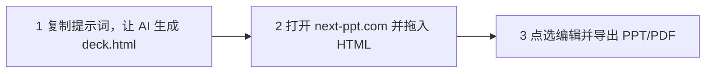
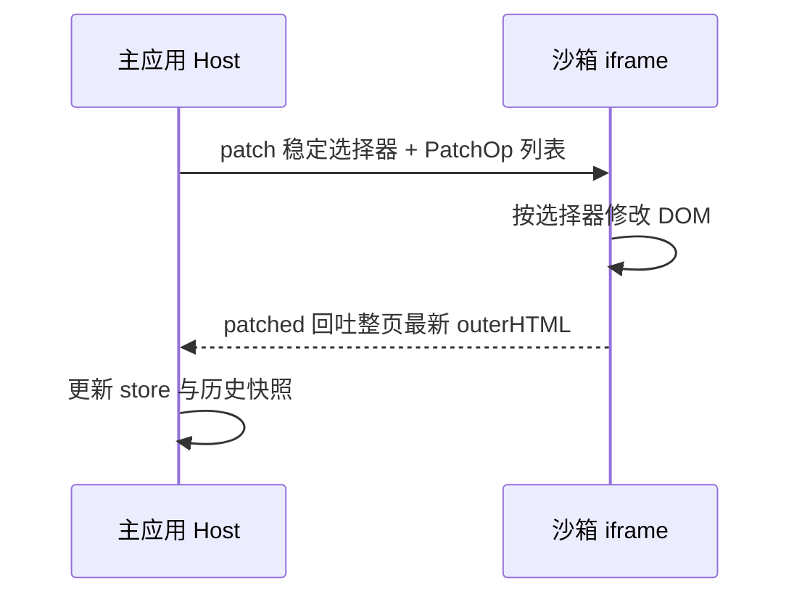
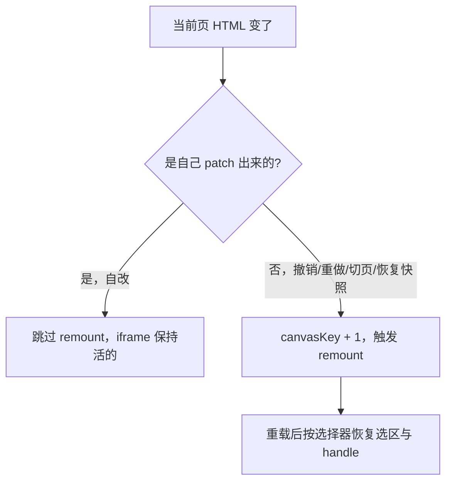
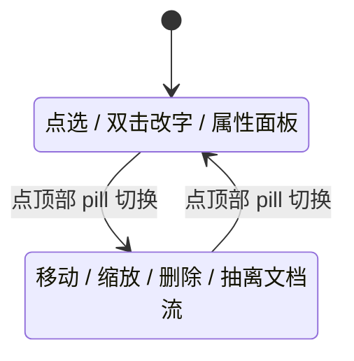
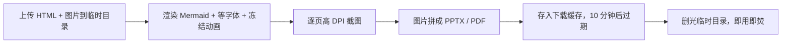

AI 现在已经很会生成漂亮的 HTML 幻灯片了。


Flex/Grid 排版、KaTeX 公式、Mermaid 图表、自定义字体，这些东西交给大模型基本都能做得有模有样。相比之下，让 AI 直接生成原生 PowerPoint 那套 XML，就很容易变成大型翻车现场。

所以过去一年多，我越来越倾向于让 AI 直接产一个 `deck.html`，而不是回去跟 Keynote、PowerPoint 较劲。

但只要你真的这么干过几次，就会发现一个很现实的问题：**AI 写起来容易，改起来费劲。**

你只是想改一个标题、换一句文案、删掉一行字，却经常要回到 AI 对话框里重新 prompt、等待生成、再检查它有没有顺手改坏别的地方。

这都是朕的 Token，**朕的钱！！**

当然，也有人选择让 AI 直接把每页都做成图。但这条路同样麻烦：改几个字还得反复对话、重新生成、重新检查，进入无尽循环。所以我抽空做了一个小工具，叫 **NextPPT**。

**NextPPT 是一个面向「约定格式 HTML 幻灯片」的本地编辑与导出工具。**

它不负责生成 PPT，而是接管生成之后的最后一公里：

*   局部编辑；
*   资源管理；
*   隐私保护；
*   PPTX/PDF 交付。

简单说就是：

**让 AI 按固定结构生成 HTML 幻灯片，然后拖进 NextPPT，点哪改哪，最后导出 PPTX/PDF。**

*   官网：[next-ppt.com](https://next-ppt.com/)
*   开源代码：[github.com/Trade-Offf/NextPPT](https://github.com/Trade-Offf/NextPPT)


### 太长不读

NextPPT 解决的是 **AI 生成 HTML 幻灯片之后** 的几个问题：

*   **AI 生成 HTML PPT 很方便，但后续修改麻烦。**\
    改一个字可能就要回到对话框重发 prompt、等待生成、对比 diff，token 哗哗烧。

*   **NextPPT 支持拖入 HTML，点哪改哪。**\
    把符合约定结构的 `deck.html` 拖进浏览器，直接点选文字、图片、元素进行编辑。

*   **可导出 PPTX/PDF。**\
    投影、提交、分享最终往往还是要 `.pptx` 或 `.pdf`，NextPPT 可以一键导出高保真、图片型的 PPTX/PDF。

*   **本地编辑，不上传文件。**\
    答辩稿、客户方案、内部资料，不用传到在线编辑器。编辑阶段全程在你本机完成。

*   **免费开源。**\
    用 Chrome/Edge 打开 [next-ppt.com](https://next-ppt.com/)，复制官网提示词让 AI 生成 HTML，拖进去，点一下标题改两个字，三十秒就懂了。

如果你手边刚好有一份符合结构的 HTML 幻灯片，可以现在试一下：

1.  打开 [next-ppt.com](https://next-ppt.com/)
2.  拖入 `deck.html`
3.  点一个标题改两个字
4.  导出一份 PDF

这个动作大概 30 秒。能不能解决问题，试完就知道。

下面从「为什么需要它」一路讲到「HTML 格式要求」「怎么用」「怎么实现」以及「踩过哪些坑」。

这个观点只代表我自己，也不一定对。

***

### 一、AI 做 PPT 的问题，不是生成，而是生成之后

我做工具有个习惯：先别急着想用什么技术栈，先问这个问题的本质是什么、用户真正的痛点在哪。

把 AI 写 HTML 幻灯片这件事拆开，你会发现痛点根本不在「生成」。

生成这一步，AI 已经做得很好了。真正难受的是**生成之后**。

#### 1. 临场改一句话太难受

答辩前一晚，导师说：“小李啊，第 3、9、16 页几个字改一下。”

你以为只是改一句话，结果流程变成：

1.  回到 AI 工具；
2.  重新描述修改需求；
3.  等它重新生成；
4.  对比有没有改坏其他地方；
5.  保存覆盖；
6.  发现又多改了几处；
7.  继续 prompt。

一次还好，第十次真的很想骂人。

更要命的是，AI 经常会顺手把你没让它动的地方也「优化」了。你让它改一个标题，它可能顺便帮你重排了整页。热心是挺热心，吓人也是真吓人。

#### 2. 最终交付还是要 PPT/PDF

HTML 演示稿在本机看起来很爽，但现实交付很朴素：

*   学校可能要求交 `.pptx`；
*   客户可能要 `.pdf`；
*   老板可能要可以直接投屏的文件；
*   群里分享时，大家也更习惯打开 PPT/PDF。

而 HTML 直接上投影仪，经常会遇到这些问题：

*   字体丢失；
*   CDN 加载失败；
*   网络不稳定；
*   动画时序乱飞；
*   浏览器缩放不一致。

所以不管生成阶段多先进，交付阶段还是绕不开 PPT/PDF。

#### 3. 隐私是真的焦虑

答辩稿、客户方案、公司内部资料、培训课件，这些东西谁都不太敢随便传到一个在线编辑器里。

尤其是你不知道：

*   文件会不会被存储；
*   会不会被拿去训练；
*   后台谁能看到；
*   删除是不是真的删除。

这类工具如果一开始就要求上传全文档，其实很多人心理上就已经劝退了。


光是第一个痛点，循环起来就足够磨人。

你想改的只是一句话，付出的却是一整圈：


这三个痛点背后，其实是同一件事在变：

**AI 把「从零到一」做便宜了，于是「从一到对」那段路，反而成了新的瓶颈。**

大家都在卷怎么生成得更快、更好看，却很少有人去管生成完之后那一地鸡毛。

所以我后来想明白了：

**这个工具不该是又一个 AI PPT 生成器，而应该是一把专门修剪 AI 演示稿的剪刀。**

***

### 二、它最适合谁

NextPPT 不是想替代所有 PPT 工具。

它现在最适合三类人。

#### 1. 经常用 AI 做技术汇报的开发者

开发者做技术分享时，经常会遇到传统 PPT 不太舒服的地方：

*   代码展示麻烦；
*   流程图要手工画；
*   公式排版别扭；
*   想要更自由的页面布局；
*   希望幻灯片本身就是 HTML，方便调样式和复用。

AI 生成 HTML 幻灯片在这类场景里很自然。

但生成之后的小修改、小调整、小导出，仍然需要一个顺手的工具。

#### 2. 正在准备答辩、路演、汇报的人

答辩稿、路演稿、阶段汇报稿都有一个共同点：

**最后 10% 的修改最折磨人。**

导师、老板、合伙人、客户经常会说：

*   这里换个说法；
*   那页删掉；
*   这个图再大一点；
*   这句话太绝对；
*   最后导出一份 PDF 给我。

这些修改不值得重新生成整份幻灯片，但手动改 HTML 又太烦。

NextPPT 解决的就是这段「从 90 分改到 95 分」的路。

#### 3. 有隐私顾虑的方案作者

客户方案、内部培训、公司资料，不一定适合上传到在线编辑器。

NextPPT 的编辑阶段在本地完成，源文件不需要上传。

这对一些不想把资料丢到云端工具里的用户来说，会安心很多。

***

### 三、NextPPT 需要什么样的 HTML

这里有一个很容易被忽略、但非常关键的点：

**NextPPT 不是任意 HTML 网页编辑器。**

它需要的是一份符合约定结构的 HTML 幻灯片。

换句话说，不是随便把一个网页拖进去就能稳定编辑和导出，而是需要 AI 按一套简单规则生成演示稿。

格式要求不复杂，核心只有三条：

*   输出完整 `.html`，不要只给片段；
*   每一页必须是 `<section class="slide">...</section>`；
*   每页固定 16:9，推荐 `1280px × 720px`。

最小结构如下：

```html
<!doctype html>
<html lang="zh-CN">
<head>
  <meta charset="UTF-8" />
  <title>演示稿标题</title>
  <style>
    .slide {
      width: 1280px;
      height: 720px;
      box-sizing: border-box;
      overflow: hidden;
      position: relative;
    }
  </style>
</head>
<body>
  <section class="slide">
    <h1>第一页标题</h1>
  </section>

  <section class="slide">
    <h2>第二页标题</h2>
  </section>
</body>
</html>
```

为了让编辑体验更好，建议让 AI 使用 `h1/h2/p/ul/li/span/strong` 承载文本，不要把整页做成一张图或 Canvas。图片资源可以内联，或者用文件夹模式一起导入。

官网里已经准备了提示词，复制给 ChatGPT / Claude / Gemini / 豆包 / Kimi，生成后保存成 `deck.html`，拖进 NextPPT 就能改。

***

### 四、我想要的工具应该是什么样

想清楚问题之后，产品形态其实就比较明确了。

我挺认同马斯克那套「五步工作法」的，尤其前两步：

> 质疑每一项要求，然后大胆删掉。

所以在动手之前，我先想清楚 NextPPT **不做什么**。

#### 1. 不做 AI 生成 PPT

生成交给任意 AI 就好。

ChatGPT、Claude、Gemini、豆包、Kimi，哪个你顺手就用哪个。它们都已经很擅长生成 HTML 幻灯片。

NextPPT 不需要再做一个生成器。多做一个生成器，既卷不过大模型，又会把产品做散。

我只想接管最后一公里：

**AI 生成之后，怎么编辑、怎么保存、怎么导出。**

#### 2. 不做新的 DSL，但会约定一种简单结构

我也不想做 reveal.js / Slidev 那种 DSL 工具。

它们很好，但问题是：要重新学一套语法。而我希望 AI 直接吐出来的就是普通 HTML，用户不需要再理解一门新的标记语言。

但这里也必须讲清楚：

**NextPPT 不是任意 HTML 网页编辑器。**

它需要 AI 生成的 HTML 幻灯片满足一套很简单的结构约定：

```html
<body>
  <section class="slide">
    ...
  </section>

  <section class="slide">
    ...
  </section>
</body>
```

也就是说，每一页必须是一个 `section.slide`，直接作为 `body` 的子元素排列。

同时，每页建议固定为 16:9 画布：

```css
.slide {
  width: 1280px;
  height: 720px;
  box-sizing: border-box;
  overflow: hidden;
  position: relative;
}
```

这个约定不是为了限制用户，而是为了让后续的点选编辑、分页预览、截图导出、PPT/PDF 组装都能稳定工作。

所以 NextPPT 的思路不是发明一门新 DSL，而是给 AI 一个足够简单、足够稳定的 HTML 输出协议。

#### 3. 不做云端编辑器

这是一个很明确的产品边界。

编辑阶段不上传文件。

一上云，隐私这条最硬的卖点就没了。

所以 NextPPT 的核心目标被砍到最后，只剩下一句话：

**拿你已经有的约定格式 HTML，在浏览器里点哪改哪，再导出一份高保真的 PPT/PDF，而且编辑阶段文件全程不离开你本机。**


在 AI 让做加法变得几乎零成本的时代，**功能是堆出来的，产品却是删出来的**。

一个工具真正的样子，往往不是由它能做什么定义的，而是由它坚决不做什么定义的。

***

### 五、NextPPT 怎么用

普通用户视角下，NextPPT 的使用流程其实很简单。

就三步：

1.  让 AI 生成符合结构的 HTML 幻灯片；
2.  打开网站并拖入 HTML；
3.  编辑并导出 PPTX/PDF。



#### 第 1 步：让 AI 生成 `deck.html`

先去官网复制提示词，填入你的演示主题，然后让任意 AI 生成 HTML 文件。

这里的关键不是“让 AI 写一个网页”，而是让它按 NextPPT 的约定输出：

*   完整 HTML；
*   `section.slide` 分页；
*   固定 16:9 尺寸；
*   样式内联；
*   资源可访问；
*   文本结构清晰。

生成后保存为：

```txt
deck.html
```

#### 第 2 步：打开网站并拖入 HTML

用 Chrome 或 Edge 打开：

[https://next-ppt.com](https://next-ppt.com/)

目前因为要用到 File System Access API，所以更推荐 Chromium 系浏览器：

*   Chrome；
*   Edge；
*   Brave；
*   Arc。

Safari / Firefox 暂时还不适合完整体验。

你可以直接拖入单个 `deck.html`。

如果有图片资源目录，也可以选择整个文件夹。

#### 第 3 步：编辑并导出

进去之后，你可以像改 PPT 一样操作：

*   点选文字，在右侧面板改内容、字号、颜色；
*   双击文字，直接原位编辑；
*   选中图片，替换成新图片；
*   切到拖动模式，自由移动、缩放元素；
*   改错了可以撤销；
*   编辑过程自动保存；
*   最后导出 PPTX 或 PDF。


导出时可以选择格式和清晰度，也可以只导某几页，整个过程除了导出那几秒，其余编辑阶段都在你自己电脑上完成。

***

### 六、技术实现与踩坑

前面讲的是用户视角。下面聊聊技术实现。

做 NextPPT 时，我一直在控制三个边界：

1.  **安全边界**：用户提供的 HTML 不能污染主应用，所以必须进沙箱 iframe。
2.  **状态边界**：编辑状态尽量留在本地，服务端只做短暂计算。
3.  **保真边界**：导出优先保证视觉一致，而不是假装生成可编辑 PPT。

这三个边界定下来后，很多技术选型其实就自然了。

整个系统本质上分成两块：

*   一个浏览器 SPA，负责全部编辑；
*   一个无状态导出服务，只在你点击「导出」时短暂出现。


*   **编辑**全部在浏览器里完成，通过 File System Access API 直接读写本地文件。
*   **导出**才会把内容送到一个短命的 Puppeteer worker：高 DPI 逐页截图、拼成 PPTX/PDF、回吐文件，然后删除临时目录。

这个边界划分很关键：

**服务端只负责一次性的、可丢弃的计算，状态尽量留在用户本机。**

说到底，最硬的隐私承诺，从来不是「我保证不看」，而是让系统压根没有看的能力。

能力上的不能，永远比道德上的不愿更让人安心。


#### 1. 用 File System Access API 把「本地」做实

要做到「文件不离开本机」又「能自动保存」，靠的是浏览器的 File System Access API。

它给了两种入口，对应两种真实场景。

##### 文件夹模式

你选择一个包含 `deck.html` 和图片资源的目录，NextPPT 可以：

*   读取同级图片；
*   自动回写 HTML；
*   保留备份；
*   尽量维持原来的资源结构。

适合图文混排、资源较多的稿子。

##### 单文件模式

直接拖进来一个自包含的 `.html`。

编辑后另存为一份副本，图片可以以内联 base64 的形式处理。

适合「就一个文件」的轻量场景。

代价是，这套 API 目前主要只有 Chromium 系浏览器支持，Safari / Firefox 还得等。

这是一个清醒的取舍：

**与其做一个处处妥协的全兼容方案，不如先把 Chromium 上的体验做到极致。**

#### 2. 沙箱 iframe + 强类型 postMessage 协议

幻灯片本身是别人，也可能是 AI 写的 HTML，里面可能有任意脚本。

如果直接挂到主文档里，会有两个问题：

*   不安全；
*   样式容易互相污染。

所以每一页都渲染在一个沙箱 iframe 里，主应用和 iframe 之间只通过 `postMessage` 通信。

编辑侧的核心是一组 `PatchOp`：

```ts
export type PatchOp =
  | { kind: 'text'; value: string }
  | { kind: 'attr'; name: string; value: string | null }
  | { kind: 'style'; name: string; value: string | null }
  | { kind: 'class'; add?: string[]; remove?: string[] };
```

你在属性面板里改字号、颜色、对齐，本质上都是往 iframe 发一条 `patch` 消息。

消息里带着：

*   一个稳定 CSS 选择器；
*   一组 `PatchOp`。

iframe 修改 DOM 后，再把整页最新的 `outerHTML` 回吐给主应用。



这里最重要的不是协议写得多花，而是**选择器要稳**。

比如要忽略布局占位符、优先使用稳定 id。否则 patch 打到错的元素上，这种 bug 比「功能没做」还难查。

#### 3. 实时 iframe：自己改的不重载，别人改的才重载

最早我图样图森破，每收到一条 `patched` 就把 iframe 重新 render 一遍。

结果体验稀碎：

*   刚选中一个元素，handle 一闪没了；
*   刚插入一张图，还没来得及拖就被刷掉；
*   双击编辑时，输入状态也容易丢。

后来想明白了：

**iframe 应该是一个「活的」编辑现场，而不是一块被反复重绘的画布。**

所以我把逻辑改成：

*   iframe 自己产生的改动，比如移动、缩放、改字、patch，不触发重载；
*   只有外部原因才重新挂载，比如撤销/重做、恢复历史快照、切换页面。

判断逻辑就是拿当前 HTML 和「上一次自己 patch 出来的 HTML」比一下。

是自己改的，就跳过 remount：

```ts
if (html !== prevHtmlRef.current) {
  prevHtmlRef.current = html;
  if (html !== lastPatchedHtmlRef.current) setCanvasKey((k) => k + 1);
}
```

这套「是不是自己改的」判断，画出来就是一个分叉：



一个 `canvasKey` 控制 remount，再配合「重载后用选择器把选区重新选回来」，体验一下就顺了。

这种问题模型再强也很难替你判断，得靠你自己对状态边界的工程直觉。

#### 4. 编辑 / 拖动双模式：要 PPT 的自由，也要不误触的安全

我想让每个元素都能像原生 PPT 那样自由拖动、缩放、删除。

但马上就会遇到一个矛盾：

**自由变换和「点文字改字」会互相打架。**

你想改个字，结果手一抖把整块挪走了。

我的解法是做两个严格互斥的模式：

*   **编辑模式**：只能点选、双击文字行内编辑、使用右侧属性面板。没有拖拽 handle，不会误移。
*   **拖动模式**：可以移动、四角缩放、删除。但不能行内改字。



切到拖动模式去拽一个原本在文档流里的元素时，它会自动转成绝对定位，也就是 detach-on-grab。

这个边界是产品决策，不是技术限制。

宁可让用户多点一下切模式，也不要让他在「改字」时提心吊胆。

#### 5. 资源解析：blob URL 和相对路径的双向翻译

文件夹模式下，图片在磁盘上通常是相对路径，比如：

```txt
assets/cover.png
```

但 iframe 里要显示，通常需要转成 blob URL。

所以我维护了一张映射表：

```txt
blob URL <-> 相对路径
```

显示时，把相对路径解析成 blob。

存盘或导出时，再把 blob URL 翻译回相对路径。

这块踩过一个挺典型的坑，后面会讲。

#### 6. 历史快照：让用户永远不怕改坏

改动会防抖自动回写磁盘，同时在 `.hds-backup/` 里留带时间戳的快照。

任何时候，都能从历史版本里把之前的样子捞回来。

这条看着不起眼，但它解决的是一个心理问题：

**人只有在知道自己随时能反悔的时候，才敢放心大胆地改。**

所以 NextPPT 里有几层兜底：

*   撤销；
*   重做；
*   自动保存；
*   历史快照；
*   原文件备份。

目标很简单：让用户不要害怕把稿子改坏。

#### 7. 为什么不是纯前端导出

也有人可能会问：为什么不把导出也放到浏览器里？

我试过一些纯前端方案，但最后还是选择了服务端 Puppeteer，主要是三个原因：

1.  浏览器端截图能力受限，很难稳定处理字体、跨域图片和复杂图表；
2.  PPTX/PDF 组装在大文件场景下容易卡住主线程；
3.  服务端更容易控制渲染环境，保证不同用户导出的结果一致。

所以我的取舍是：

**编辑本地化，导出服务化；状态留本地，计算短暂外包。**

#### 8. 导出管线：Puppeteer 高 DPI 截图 → 图片型 PPTX/PDF

导出是唯一碰服务端的环节。

思路很直白：

**把每一页当成一张高清照片拍下来，再拼进 PPTX/PDF。**

为什么是「图片型」而不是去还原可编辑的 PPT 元素？

因为高保真和「PPT 里还能改字」是冲突的。

用户的核心诉求是：

> 导出来长得和我的 HTML 一模一样。

所以我选了高保真，并且明确告诉用户：导出的是图片型 PPT/PDF，想改字就回 NextPPT 改完再导一次。

服务端这边有几个细节。

##### 超采样控制分辨率

幻灯片固定在 1280×720 画布上，输出清晰度靠 `deviceScaleFactor` 拉。

```ts
// 固定 1280×720 画布，清晰度只由 deviceScaleFactor 决定
const SCALE_BY_RESOLUTION = {
  '1280x720@2x': 2,  // 2560×1440
  '1920x1080@2x': 3, // ~4K
  '3840x2160@2x': 4, // 5120×2880
};
```

视口不变，缩放因子变。

##### 等渲染完成再截图

AI 生成的稿子里，经常有没渲染完成的 Mermaid 源码。

所以截图前要做几件事：

*   渲染未完成的 Mermaid 节点；
*   等待 `document.fonts.ready`；
*   等 KaTeX / Google Fonts 落定；
*   冻结所有动画。

否则很容易截出来缺图、缺字，或者动画糊成一团。

##### SSE 推进度

页数多、页面复杂时，导出会慢。

所以我用 Server-Sent Events 把进度实时推给前端：

```txt
unpack -> screenshot -> assemble
```

这样用户不至于对着一个转圈干等。

##### 即用即焚

整个导出在一个 `mkdtemp` 出来的临时目录里完成。

结束后：

*   `finally` 里 `fs.rm` 删除临时目录；
*   产物放进一个有 10 分钟 TTL 的下载缓存；
*   过期自动清理；
*   服务端不持久化任何东西。

一整条导出流水线长这样：



#### 9. 顺手把工具站做出 SEO：SSG + i18n

工具站不能只有一个空壳 `index.html`。

我既想要 React 的交互，又想要爬虫和分享卡片能拿到真实内容。

所以落地页和指南页用了 `vite-react-ssg` 做静态预渲染，按路径前缀分中英双语：

*   `/`
*   `/en`

每个语言版本都预渲染出带这些信息的真实 HTML：

*   `title`
*   `description`
*   `canonical`
*   `hreflang`

这部分不算核心功能，但它是长期主义。

一个工具想被人用，得先能被搜到，也得在被分享出去时长得体面。

#### 10. 踩过的几个真实坑

写工具最有价值的部分，往往是那些 README 里不会写、但你确实流过血的地方。

挑几个印象最深的。

##### 坑 1：拖动之后，整个版面塌了

第一版把元素从文档流里「拎出来」变成绝对定位时，它原来占的位置会瞬间塌缩。

后面的元素全往上挤，于是你一拖第二个，测出来的坐标全是错的。

结果就是：所有浮动元素叠在一起。

解法是：

**抽离前先在原位插一个透明占位符。**

比如：

```html
<div data-hds-placeholder></div>
```

用它把原来的空间占住。

元素删除或还原自动布局时，再回收掉这些占位符。

一个很小的 trick，但不想到就是天天 debug。

##### 坑 2：存盘存进去一堆「死」的 blob URL

文件夹模式下，图片在 iframe 里是 blob URL。

我一开始直接把这份 HTML 写回磁盘了。

结果下次打开，blob 早失效了，图片全裂。

后来才意识到：

**存盘必须走和导出一样的「还原相对路径」逻辑。**

也就是把 blob URL 翻译回：

```txt
assets/xxx.png
```

再落盘。

两条路径用同一套还原函数，才算闭环。

##### 坑 3：SSG 之后页面出现两个 title

静态预渲染会注入一份 `title`，而 `index.html` 里我又留了一个硬编码的。

结果页面里出现两个 `<title>`。

解决办法很简单：

删掉模板里的默认 title。

小坑，但分享出去标题重复，挺丢人的。

这几个坑的共同点是：

**它们都不是模型能帮你自动发现的问题，得自己跑、自己看真实结果、自己判断。**

AI 能帮我写出八成样板代码，但最后两成的「为什么不对」，还得是人。

***

### 七、目前的限制

NextPPT 现在还是 MVP，有几个限制我也先讲清楚。

*   它不是通用 HTML 网页编辑器，更适合符合 `section.slide` 约定的 HTML 幻灯片；
*   更适合 16:9、固定尺寸的页面，比如 `1280px × 720px`；
*   对复杂动画的导出目前只会冻结为静态画面；
*   导出的 PPTX 是图片型，不是可编辑元素型；
*   完整体验依赖 File System Access API，推荐 Chrome/Edge；
*   对特别野的 HTML 结构，点选和 patch 逻辑可能还需要继续增强；
*   如果页面依赖远程资源，导出稳定性会受网络和跨域策略影响。

这些限制不影响核心链路，但它们决定了 NextPPT 现在最适合的使用边界：

**AI 先按规则生成一份差不多的 HTML 幻灯片，然后用 NextPPT 做最后的编辑、整理和交付。**

***

### 八、为什么开源

为什么开源？

一方面，这类工具涉及本地文件、导出和隐私，开源能让用户更容易信任它。

另一方面，HTML 幻灯片的形态太多了，我不可能一个人覆盖所有边界。

有的人用纯 HTML，有的人用 Tailwind，有的人用 reveal.js 的结构，有的人会让 AI 写一堆内联样式，还有的人会塞 Mermaid、KaTeX、SVG、Canvas。

开源不是把代码扔出去就完事，而是希望让更多真实工作流里的问题浮出来：

*   哪些 HTML 结构不兼容；
*   哪些导出场景会失败；
*   哪些交互真的别扭；
*   哪些能力应该做成默认功能；
*   哪些需求应该坚决不做。

一个工具最好的样子，一定来自真正天天活在这个工作流里的人，而不是某次灵光一现。

***

### 九、开源地址与后续计划

NextPPT 现在还只是一个 MVP，谈不上完美。

但我越来越相信，一个工具做到极致，不是功能越来越多，而是让人用着用着忘了它的存在。

如果它能帮你省下答辩前那个难受的晚上，对我来说就已经值了。

毕竟说到底，我们写的每一行代码、做的每一个工具，最后都是在一点点雕刻自己。

*   官网体验：<https://next-ppt.com/>
*   开源代码：<https://github.com/Trade-Offf/NextPPT>

Please feel free to use and contribute to the development.

有想法欢迎提 Issue、发 PR。开源用异步沟通，比拉群靠谱。

#### 后续可能会做的事

目前我比较想继续打磨这些方向：

*   更好的 HTML 幻灯片兼容性；
*   更稳的元素选择器和 patch 逻辑；
*   更好的图片、字体、资源处理；
*   更细的导出参数控制；
*   更完善的历史版本管理；
*   更友好的新手提示词和模板；
*   更高规格的导出队列和渲染服务；
*   尝试支持 HTML 动画导出为 PPT 动画。

最后一点比较难。

HTML 动画和 PPT 动画不是一个模型，真要做得自然，可能需要设计一层 DSL 或映射规则。这个坑有点大，如果有人能 PR 解决，那真是好心人中的好心人。

#### 关于免费和商业化

这里也做一个明确承诺：

**核心链路「导入 -> 编辑 -> 导出」永久免费。**

当然，导出服务确实会产生服务器成本，所以我也会持续优化队列、缓存和资源占用。

未来如果真的探索商业化，也只会围绕一些增量能力，比如：

*   团队协作；
*   批量导出；
*   更高规格渲染；
*   品牌模板；
*   动画导出；
*   企业私有化部署。

但这些都不会影响核心链路。

现在对我来说，更重要的是先把这个工具打磨到足够顺手，让它真的解决「AI 生成之后，怎么编辑和交付」这个问题。

所以，欢迎使用，欢迎 Star，也欢迎提 Issue。

如果你刚好也被「AI 生成 PPT 很爽，但改起来很痛苦」这个问题折磨过，可以试试 NextPPT。
